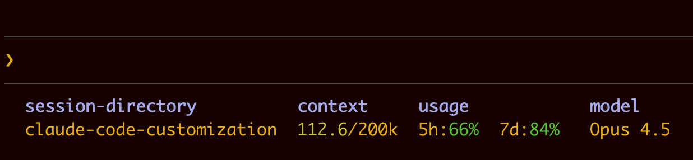

# Claude Code Customization

Custom status line showing context and usage for Claude Code.

## Status Line



Displays context window and remaining usage in the Claude Code interface:

```
session-directory  context     usage            model
my-project         100.1/200k  5h:42% 7d:92%   Opus 4.5
```

- **session-directory** - Current working directory (basename)
- **context** - Tokens used / context window size (numerator color-coded)
- **usage** - 5-hour and 7-day rolling window remaining (color-coded)
- **model** - Current model name

Colors: green (>50% remaining), yellow (20-50%), red (<20%)

Headers are bold blue.

## Setup

1. Copy the status line script:
   ```bash
   cp statusline.sh ~/.claude/statusline.sh
   chmod +x ~/.claude/statusline.sh
   ```

2. Add to `~/.claude/settings.json`:
   ```json
   {
     "statusLine": {
       "type": "command",
       "command": "~/.claude/statusline.sh"
     }
   }
   ```

3. Restart Claude Code.

## Requirements

- macOS (uses Keychain for auth token)
- Python 3 (for JSON parsing)
- curl

## How It Works

The script calls an undocumented API endpoint (`/api/oauth/usage`) using the OAuth token stored in macOS Keychain. This is the same endpoint that powers the `/usage` command in Claude Code.

See [UNDOCUMENTED_APIS.md](UNDOCUMENTED_APIS.md) for details on the reverse engineering process.

## Files

- `statusline.sh` - Status line script
- `UNDOCUMENTED_APIS.md` - Documented findings from reverse engineering
- `CLAUDE.md` - Context for Claude Code working in this repo
